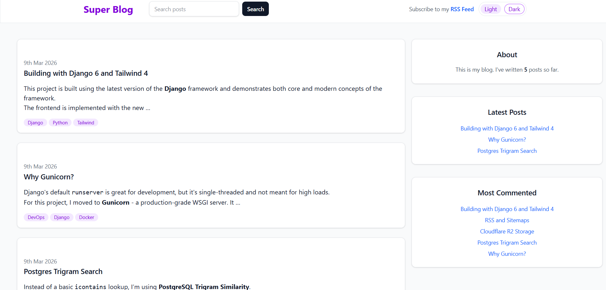
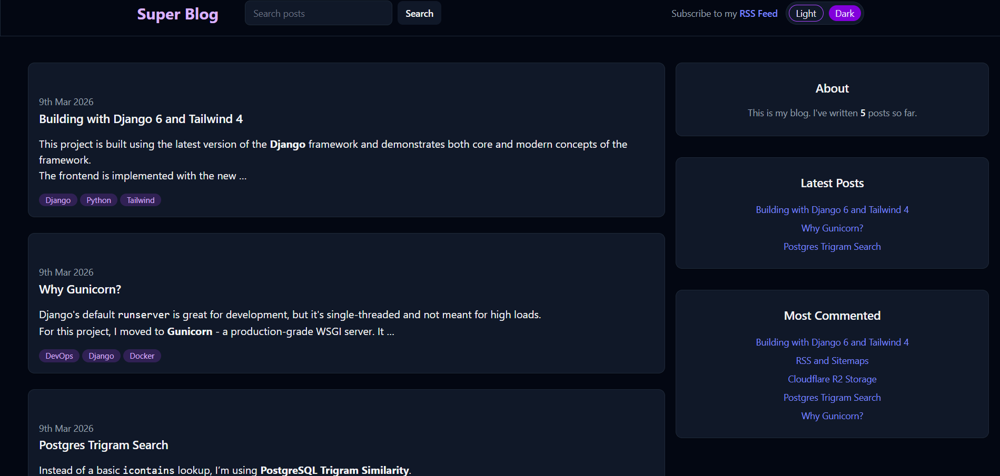
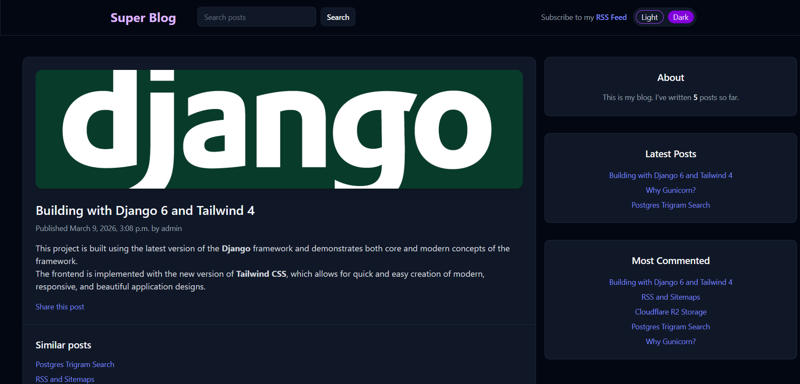

## Blog Platform (Django + PostgreSQL + Tailwind)

A modern blog application focused on clean architecture and PostgreSQL features.
Built with Django 6, Postgres 16, and the new Tailwind CSS 4 CLI pipeline.
The project includes full content flow (posts, tags, comments), search, RSS feed, sitemap,
containerized workflows, and optional object storage integration for static/media assets.

### Desktop Interface
| Light Mode | Dark Mode |
|:---:|:---:|
|  |  |

### Features
| Dynamic Content & Sidebar | Interactive Comments |
|:---:|:---:|
|  |  |

## Why This Project

My focus for this project was on these patterns:

- Domain modeling with publish states and query managers
- Relational features (tags, comments, similar content)
- Postgres-native search (`TrigramSimilarity`)
- SEO and distribution features (sitemap + RSS)
- Cloud-ready storage via S3-compatible backend (Cloudflare R2)
- Reproducible dev/test setup via Docker + Make 
- Dual-mode: support for both development (Django runserver) and production (Gunicorn) modes

## Feature Set

- Post lifecycle: draft/published status with custom manager
- Explicit logic with Function-Based Views (FBVs)
- Tagging: `django-taggit` integration with tag-based filtering
- Comments: moderated comment flow (`active` flag)
- Post sharing by email (SMTP integration)
- Similar posts recommendation (tag overlap ranking)
- Fuzzy search on post titles (PostgreSQL trigram similarity)
- RSS feed for latest posts
- XML sitemap for crawlers
- Responsive UI styling pipeline with Tailwind CSS 4
- Theme Support: Adaptive system-based dark/light mode with a manual toggle
- Markdown Content: Support for safe post formatting using Markdown syntax

## Tech Stack

- Backend: Python 3.13, Django 6 (Gunicorn)
- Database: PostgreSQL 16
- Frontend styles: Tailwind CSS 4 (`@tailwindcss/cli`)
- Storage: `django-storages` + S3-compatible object storage (Cloudflare R2)
- Tooling: Docker, Docker Compose, Make, uv, pytest

## Quick Start (Docker)

1. Create a `.env` file in the project root.
2. Copy variables from .env.example and fill them with your data. 
3. Note: Environment Modes: Set DEBUG=True in your .env for development (auto-reload)
   or DEBUG=False to switch to the Gunicorn production server.
4. Build and run services:

```bash
make up-build
```

5. Run migrations:

```bash
make migrate
```

6. Create admin user:

```bash
make superuser
```

7. Open app:

- Blog: `http://localhost:8000/blog/`
- Admin: `http://localhost:8000/admin/`

## Tailwind CSS Scripts

From `app/` directory:

- Build minified CSS:

```bash
npm run build:css
```

- Watch and rebuild on changes:

```bash
npm run watch:css
```

Input: `blog/static/src/input.css`  
Output: `blog/static/dist/styles.css`

## Common Commands

- Start: `make up`
- Rebuild: `make build`
- Stop: `make down`
- Logs: `make logs`
- Shell in web container: `make shell`
- Make migrations: `make makemigrations`
- Apply migrations: `make migrate`
- Build Tailwind CSS and collect static: `make collectstatic`
- Run tests: `make test`

## Application Endpoints

- `/blog/` - post list with pagination
- `/blog/<year>/<month>/<day>/<slug>/` - post detail
- `/blog/tag/<tag>/` - filter by tag
- `/blog/search/` - fuzzy title search
- `/blog/feed/` - RSS feed
- `/sitemap.xml` - sitemap

## Testing

Run tests in dedicated test profile:

```bash
make test
```

## Future Improvements

The project already includes a solid deployment foundation (Gunicorn, Docker, PostgreSQL, optional R2 storage).  
Next steps to strengthen scalability and operations:

- **Background Workers:** Add **Celery + Redis** for asynchronous email delivery and scheduled jobs.
- **Search Quality:** Evolve search from trigram matching to **PostgreSQL Full-Text Search** with ranking and highlighting.
- **Observability:** Integrate **Sentry** for error tracking and add **Prometheus + Grafana** metrics dashboards.
- **CI/CD:** Add **GitHub Actions** for linting, tests, and deployment checks (`manage.py check --deploy`).
- **Security Hardening:** Finalize production security defaults (HTTPS redirects, secure cookies, HSTS, CSP).
